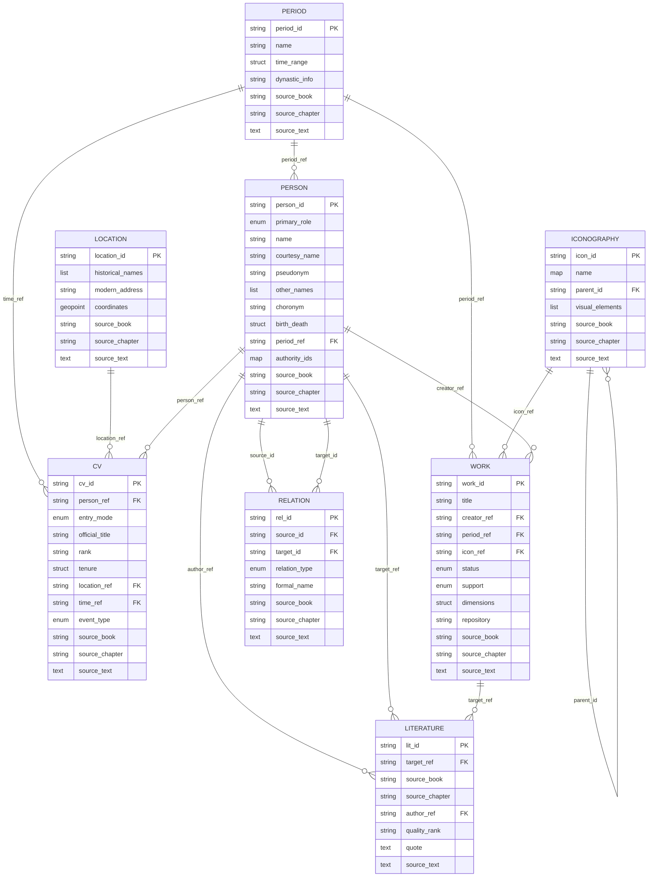

# **中国人物画知识图谱数据结构规范 (M3 Framework v1.6)**

## **0\. 数据溯源与质量保证**

### **0.1 来源追踪字段规范**

为确保学术数据的可追溯性和可靠性，所有实体表均包含以下统一的来源追踪字段：

| 字段名称 | 数据类型 | 描述 | 必填性 | 格式规范 |
| :---- | :---- | :---- | :---- | :---- |
| source\_book | String | 来源典籍名称 | 必填 | 使用书名号《》，如《历代名画记》 |
| source\_chapter | String | 来源章节/卷次 | 强烈推荐 | 格式：卷次+章节名，如"卷一·顾野王" |
| source\_text | Text | 原始引用文本 | 推荐 | 保留原文标点，使用""标注引文 |
| source\_page | String | 页码/版本信息 | 可选 | 如"第12页"、"四库本卷三" |

### **0.2 溯源字段填写规则**

#### **0.2.1 书名规范 (source_book)**
- **格式**：统一使用中文书名号《》
- **示例**：
  - ✅ 正确：`《历代名画记》`
  - ✅ 正确：`《宣和画谱》`
  - ❌ 错误：`历代名画记`（缺少书名号）
  - ❌ 错误：`<历代名画记>`（使用错误符号）

#### **0.2.2 章节规范 (source_chapter)**
- **格式**：`卷次·章节名称` 或 `卷次·子章节·具体条目`
- **示例**：
  - ✅ 标准格式：`卷一·顾野王`
  - ✅ 详细格式：`卷三·西京寺观等画壁·兴善寺`
  - ✅ 简化格式：`卷五`（无具体章节名时）
  - ⚠️ 可接受：`卷一 顾野王`（使用空格分隔）

#### **0.2.3 原文引用规范 (source_text)**
- **格式**：保留原文标点，完整引用关键句段
- **长度**：建议50-500字，核心信息完整即可
- **示例**：
  ```
  "赵孟頫，字子昂，号松雪道人，吴兴人。宋宗室，入元官至翰林学士承旨，荣禄大夫。善书画，精鉴赏，书画之学，冠绝当代。"
  ```
- **省略规则**：
  - 使用`...`表示省略部分
  - 保留关键信息，省略无关描述
  - 示例：`"赵孟頫，字子昂...善书画，精鉴赏..."`

#### **0.2.4 多来源处理规则**
当同一信息来自多个文献时，采用以下策略：

**方案A：主要来源法（推荐）**
- 选择最权威或最早的文献作为主要来源
- 在备注字段中记录其他来源
```json
{
  "source_book": "《历代名画记》",
  "source_chapter": "卷一·顾野王",
  "source_text": "顾野王，字希冯...",
  "source_notes": "另见《宣和画谱》卷三、《图绘宝鉴》卷二"
}
```

**方案B：多源数组法（用于关键数据）**
```json
{
  "sources": [
    {
      "source_book": "《历代名画记》",
      "source_chapter": "卷一·顾野王",
      "source_text": "顾野王，字希冯..."
    },
    {
      "source_book": "《宣和画谱》",
      "source_chapter": "卷三",
      "source_text": "顾野王善画..."
    }
  ]
}
```

### **0.3 溯源字段应用示例**

#### **示例1：人物基本信息**
```json
{
  "person_id": "meso_zhao_mengfu",
  "name": "赵孟頫",
  "courtesy_name": "子昂",
  "source_book": "《图绘宝鉴》",
  "source_chapter": "卷五·元朝",
  "source_text": "赵孟頫，字子昂，号松雪道人，吴兴人。宋宗室，入元官至翰林学士承旨。善书画，精鉴赏，书画之学，冠绝当代。"
}
```

#### **示例2：作品著录**
```json
{
  "work_id": "micro_luoshen_fu",
  "title": "洛神赋图",
  "source_book": "《宣和画谱》",
  "source_chapter": "卷七·人物三",
  "source_text": "顾恺之《洛神赋图》，曹植洛神赋，恺之为之图，人物秀丽，山水幽深。",
  "source_page": "卷七第三十二条"
}
```

#### **示例3：社会关系**
```json
{
  "rel_id": "rel_zhao_guan_001",
  "source_id": "meso_zhao_mengfu",
  "target_id": "meso_guan_daosheng",
  "relation_type": "Spouse",
  "source_book": "《书史会要》",
  "source_chapter": "卷七·元朝书家",
  "source_text": "赵孟頫妻管道升，字仲姬，亦善书画。夫妇齐名，时人称为'赵管'。"
}
```

### **0.2 数据质量标准**

1. **来源完整性**：每条记录必须明确标注来源文献
2. **引用准确性**：source_text字段应尽可能保留原始文献的完整表述
3. **多源验证**：重要信息应通过多个文献来源交叉验证
4. **时序一致性**：确保人物生卒年、作品年代与文献记载的一致性

## **1\. M1: 宏观层 (Macro-Level) \- 定义域与本体库**

定义系统的分类标准、时空坐标系，不存储具体实例。

### **1.1 时序本体 (Temporal Ontology)**

| 字段名称 | 数据类型 | 描述 | 关联/示例 |
| :---- | :---- | :---- | :---- |
| period\_id | String (PK) | 时代唯一标识 | period\_tang\_high |
| name | Str | 标准名称 | 盛唐 |
| time\_range | Struct | 公历范围 | {"start": 713, "end": 766} |
| dynastic\_info | Str | 传统纪年(朝代/年号) | 唐·开元天宝 |
| source\_book | String | 来源典籍 | 《历代名画记》 |
| source\_chapter | String | 来源章节 | 卷一 |
| source\_text | Text | 原始引用文本 | "开元、天宝之代..." |

### **1.2 空间地理本体 (Spatial Ontology)**

| 字段名称 | 数据类型 | 描述 | 关联/示例 |
| :---- | :---- | :---- | :---- |
| location\_id | String (PK) | 地理唯一标识 | loc\_suzhou |
| historical\_names | List\<Map\> | 历史曾用名(含时间段) | \[{"name": "平江府", "period": "period\_song"}\] |
| modern\_address | Str | 现代对应地址 | 江苏省苏州市 |
| coordinates | GeoPoint | 地图经纬度 | \[120.58, 31.30\] |
| source\_book | String | 来源典籍 | 《历代名画记》 |
| source\_chapter | String | 来源章节 | 卷三 |
| source\_text | Text | 原始引用文本 | "苏州，古称吴郡..." |

### **1.3 图像志题材分类 (Iconography Ontology)**

| 字段名称 | 数据类型 | 描述 | 关联/示例 |
| :---- | :---- | :---- | :---- |
| icon\_id | String (PK) | 题材标识 | icon\_lohan |
| name | Map\<Lang, Str\> | 题材名称 | {"zh": "罗汉", "en": "Arhat"} |
| parent\_id | String (FK) | 父级分类 | 指向 icon\_id (如：宗教人物) |
| visual\_elements | List\<String\> | 图像判定特征(持物/服饰) | \["锡杖", "钵", "纳衣"\] |
| source\_book | String | 来源典籍 | 《历代名画记》 |
| source\_chapter | String | 来源章节 | 卷二 |
| source\_text | Text | 原始引用文本 | "罗汉像，持锡杖，着纳衣..." |

## **2\. M2: 中观层 (Meso-Level) \- 历史人物与社交网络**

以“人”为核心，记录社会属性、生平与关系网。

### **2.1 历史人物核心表 (Historical Figures)**

| 字段名称 | 数据类型 | 描述 | 关联/示例 |
| :---- | :---- | :---- | :---- |
| person\_id | String (PK) | 人物唯一标识 | meso\_zhao\_mengfu |
| primary\_role | Enum | 核心身份类型 | Painter, Collector, Connoisseur |
| name | Str | 常用姓名（含姓和名） | 赵孟頫 |
| courtesy\_name | Str | 字（成年后使用的正式称呼） | 子昂 |
| pseudonym | Str | 号/别号（自取雅号，多见于款识） | 松雪道人 |
| other\_names | List\<String\> | 其他称谓列表（庙号、谥号、法号等） | \["宋徽宗", "教主道君皇帝"\] |
| choronym | Str | 郡望/籍贯（如“吴兴人”） | 吴兴 |
| birth\_death | Struct | 生卒信息 | {"birth": 1254, "death": 1322, "period\_ref": "period\_yuan"} |
| period\_ref | String (FK) | **断代/所属时代** | 指向 period\_id  |
| authority\_ids | Map | 权威库链接 | {"CBDB": "17647", "Wikidata": "Q197463"} |
| source\_book | String | 来源典籍 | 《图绘宝鉴》 |
| source\_chapter | String | 来源章节 | 卷五 |
| source\_text | Text | 原始引用文本 | "赵孟頫，字子昂，号松雪道人..." |
### **2.2 履历与时空轨迹 (Curriculum Vitae & Trajectory)**

说明：记录画家的科举功名、入仕途径、历任官职及游历行踪，构建其政治社会地位坐标。

| 字段名称 | 数据类型 | 描述 | 关联/示例 |
| :---- | :---- | :---- | :---- |
| cv\_id | String (PK) | 履历记录标识 | cv\_zhao\_001 |
| person\_ref | String (FK) | 关联人物 | 指向 person\_id |
| entry\_mode | Enum | 入仕途径 | Recommendation (荐举), Examination (科举) |
| official\_title | Str | 官名/职衔 | 兵部侍郎 |
| rank | String | 品阶 | 正四品下 |
| tenure | Struct | 任期/时长 | {"start": 1310, "end": 1313} |
| location\_ref | String (FK) | 任地/地点 | 指向 location\_id |
| time\_ref | String (FK) | 发生时间(时代) | 指向 period\_id |
| event\_type | Enum | 轨迹类型 | Official\_Post (任官), Travel (游历) |
| source\_book | String | 来源典籍 | 《元史》 |
| source\_chapter | String | 来源章节 | 本传 |
| source\_text | Text | 原始引用文本 | "至元二十三年，除兵部侍郎..." |

### **2.3 社会关系实例 (Social Relations)**

| 字段名称 | 数据类型 | 描述 | 关联/示例 |
| :---- | :---- | :---- | :---- |
| rel\_id | String (PK) | 关系实例标识 | rel\_001 |
| source\_id | String (FK) | 起始人物 | meso\_zhao\_mengfu |
| target\_id | String (FK) | 目标人物 | meso\_guan\_daosheng |
| relation\_type | Enum | 关系分类 | Kinship, Master\_Student, Friendship |
| formal\_name | Str | 关系具体描述 | 夫妻 |
| source\_book | String | 来源典籍 | 《图绘宝鉴》 |
| source\_chapter | String | 来源章节 | 卷五 |
| source\_text | Text | 原始引用文本 | "赵孟頫娶管道昇女为妻..." |

## **3\. M3: 微观层 (Micro-Level) \- 艺术本体与视觉证据**

以“物”为核心，整合存世实物与文献记录。

### **3.1 作品实体表 (Artworks)**

| 字段名称 | 数据类型 | 描述 | 关联/示例 |
| :---- | :---- | :---- | :---- |
| work\_id | String (PK) | 作品唯一标识 | work\_luoshen\_001 |
| title | Str | 标题 | 洛神赋图 |
| creator\_ref | String (FK) | 关联作者 | 指向 person\_id (匿名作品可为空) |
| period\_ref | String (FK) | **断代/所属时代** | 指向 period\_id (解决匿名作品定位) |
| icon\_ref | String (FK) | 题材分类 | 指向 icon\_id |
| status | Enum | 存世状态 | Extant, Lost, Copy |
| support | Enum | 媒介/载体 | Silk, Paper, Wall |
| dimensions | Struct | 画心尺寸 | {"height": 27.1, "width": 572.8, "unit": "cm"} |
| repository | Str | 现藏机构 | 故宫博物院 |
| source\_book | String | 来源典籍 | 《宣和画谱》 |
| source\_chapter | String | 来源章节 | 卷七 |
| source\_text | Text | 原始引用文本 | "洛神赋图，绢本，高二尺七寸..." |

### **3.2 文献著录与品评 (Literature & Criticism)**

| 字段名称 | 数据类型 | 描述 | 关联/示例 |
| :---- | :---- | :---- | :---- |
| lit\_id | String (PK) | 文献记录标识 | lit\_001 |
| target\_ref | String (FK) | 关联对象 | 指向 person\_id 或 work\_id |
| source\_book | Str | 出处典籍 | 《宣和画谱》 |
| source\_chapter | String | 来源章节 | 卷七 |
| author\_ref | String (FK) | 评论者 | 指向 person\_id |
| quality\_rank | String | 艺术品第 | 神品, 妙品, 能品, 逸品 |
| quote | Text | 原始文本 | "画人物，最为难工..." |
| source\_text | Text | 完整原始引用 | "宋徽宗评曰：画人物，最为难工..." |

## **4\. 完整性检查与逻辑链接说明**

1. **时空双链路**：  
   * **路径 A (人承载)**：通过 M2.2 CV 表记录的官职任期和地点，结合 M1.1 和 M1.2 还原人物轨迹。  
   * **路径 B (直连)**：M3.1 Work \-\> M1.Period。  
2. **题材链路**：M3.1 Work \-\> M1.3 Iconography。  
3. **社会链路**：通过 M2.3 Relation 和 M2.2（如同年、同僚关系）构建人物社交网络。  
4. **虚实链路**：通过 status 字段整合实物证据与文献证据。

## **5\. 数据溯源与学术验证**

### **5.1 来源追踪的重要性**

中国艺术史研究的核心挑战在于文献资料的复杂性和多源性。本知识图谱通过系统性的来源追踪机制，确保：

1. **学术透明性**：每条数据都能回溯到原始文献
2. **证据链完整性**：从古籍记载到现代研究的完整链条
3. **交叉验证能力**：多源文献的比对和验证
4. **版本演变记录**：同一对象的不同时期记载的对比

### **5.2 来源字段使用指南**

#### **source_book 字段规范**
- **必填性**：所有记录必须明确标注来源典籍
- **格式标准**：使用标准书名，如《历代名画记》、《宣和画谱》
- **版本说明**：如有必要，标注版本信息（如"明刻本"、"清抄本"）

#### **source_chapter 字段规范**
- **卷次标识**：如"卷一"、"卷十上"
- **章节标题**：如"顾野王"、"西京寺观等画壁"
- **页码信息**：如需要，可附加页码信息

#### **source_text 字段规范**
- **完整性**：尽可能保留原始文献的完整表述
- **标点还原**：保持古籍原有的标点习惯
- **上下文保留**：包含必要的上下文信息便于理解

### **5.3 数据质量控制流程**

1. **来源验证**：确保 source_book 对应的文献确实存在
2. **章节定位**：验证 source_chapter 在对应典籍中的准确位置
4. **文本比对**：将 source_text 与原始文献进行比对验证
4. **多源交叉**：重要信息通过多个独立来源验证
5. **时序一致性**：检查时间信息与文献记载的一致性

### **5.4 溯源查询示例**

```sql
-- 查询赵孟頫的所有来源文献
SELECT DISTINCT source_book, source_chapter, source_text
FROM historical_figures
WHERE name = '赵孟頫' AND source_book IS NOT NULL;

-- 查找特定文献中的所有人物记录
SELECT name, primary_role, source_text
FROM historical_figures
WHERE source_book = '《图绘宝鉴》';
```

## **6\. 附录：字段映射表**

### **6.1 数据类型定义**

| 数据类型 | 描述 | 示例 |
| :---- | :---- | :---- |
| String (PK) | 主键字符串 | "meso_zhao_mengfu" |
| String (FK) | 外键字符串 | "period_tang_high" |
| String | 普通字符串 | "赵孟頫" |
| Text | 长文本 | "画人物，最为难工..." |
| Struct | 结构化数据 | {"birth": 1254, "death": 1322} |
| List\<String\> | 字符串列表 | ["宋徽宗", "教主道君皇帝"] |
| List\<Map\> | 映射列表 | [{"name": "平江府", "period": "period_song"}] |
| Map\<Lang, Str\> | 多语言映射 | {"zh": "罗汉", "en": "Arhat"} |
| Map | 键值对映射 | {"CBDB": "17647", "Wikidata": "Q197463"} |
| Enum | 枚举类型 | "Painter", "Collector" |
| GeoPoint | 地理坐标 | [120.58, 31.30] |

### **6.2 版本历史**

- **v1.0 (2024-01)**：初始版本，定义基础框架
- **v1.3 (2024-06)**：完善字段定义，增加来源追踪
- **v1.4 (2024-09)**：优化数据类型，增加多语言支持
- **v1.5 (2024-12)**：当前版本，完善溯源机制和质量控制
- **v1.6 (2026-03)**：添加实体关系图，完善文档可视化

## **7\. 实体关系图 (Entity Relationship Diagram)**

以下是基于M3框架的实体关系图，展示了各个实体之间的关联关系和主键、外键约束：



### **7.1 图例说明**

- **PK**: Primary Key (主键) - 实体的唯一标识符
- **FK**: Foreign Key (外键) - 指向其他实体主键的引用
- **||--o{**: 一对多关系 (One-to-Many)
- **实体名称**: 使用大写字母表示主要实体类型

### **7.2 关系说明**

1. **PERIOD (时序本体)**: 作为宏观层的基础，为人物、履历和作品提供时代定位
2. **LOCATION (空间地理本体)**: 为履历记录提供地理位置信息
3. **ICONOGRAPHY (图像志题材)**: 支持作品的题材分类，具有层级结构
4. **PERSON (历史人物)**: 中观层核心，连接履历、社会关系、作品和文献
5. **CV (履历与时空轨迹)**: 记录人物的职业生涯和时空轨迹
6. **RELATION (社会关系)**: 构建人物之间的社交网络
7. **WORK (作品实体)**: 微观层核心，记录艺术作品信息
8. **LITERATURE (文献著录)**: 记录对人物或作品的文献评论和品评